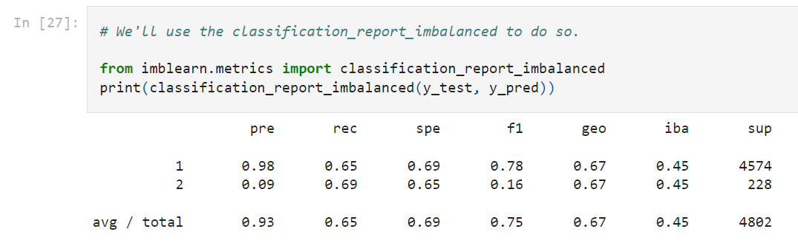

# Final-Project

[Tableau link](https://public.tableau.com/views/COVID_Unemployment_FinalProject/Demographics_COVID_Unemploment?:language=en-US&publish=yes&:display_count=n&:origin=viz_share_link)
[Google Slides link](https://docs.google.com/presentation/d/1k6wv3H_Mgpk6BEwemjXwz6_-_uWN5hgIVZbxTKltWvo/edit?usp=sharing)

## The economic impact of COVID across people in different demographic groups and education levels.

## Introduction
COVID has had a huge impact on the economy and our lives. The impact of COVID has not been uniform across different groups. By conducting this study, we hope to examine how COVID has affected individuals in terms of their employment situation. Findings from this study could help policy makers in creating appropriate support structures for affected individuals. For this study, we have narrowed our focus to North Carolina. 

## Data Source
The data for this project has been downloaded from Integrated Public Use Microdata Series (IPUMS)[1] which is the world's largest individual-level population database.
[IPUMS](https://en.wikipedia.org/wiki/IPUMS)
The data itself is from the American Community Survey (ACS) which is a demographics survey program conducted by the U.S. Census Bureau.
[ACS](https://en.wikipedia.org/wiki/American_Community_Survey)

## Purpose
The primary question that this project aims to answer is:

What are the demographic and educational attainment factors that predict who is able to work in North Carolina even during a pandemic?

## Machine Learning Model
### Description of Preprocessing

Our initial dataset (filename: Data_Cleaning/demogrphic_data_NC.csv) was created from a raw file, which was pared down to show only North Carolina data. The data was read into a Jupyter Notebook and Pandas was used to created a DataFrame whilst dropping some columns.  The rows of this dataset were cleaned to drop records with "99" values, aka, bad data.  This dataset included only number values, which corresponded to text values; data was cleaned to show the corresponding text values instead of the coded numbers, so that the data would make sense to a person reading it.  Data was mapped for: Sex, Education Level, Race, and Marital Status.  

### Machine Learning part 1
The above mentioned variables - Sex, Education Level, Race, and Marital Status - were selected as features, and 'COVIDUNAW' was selected as the target.  The COVIDUNAW field was an indicator of whether or not the person was able to work.  
First (filename: Machine_Learning/CCMachineLearning3.ipynb), we attempted to use a simple straightforward Supervised Learning Model from the SciKit Learn (sklearn) library.  To prepare our data for this, we employed the Pandas get_dummies() method. Then, we split our data into Training and Testing sets by using the train_test_split method from the sklearn library.  Using another method from sklearn library, StandardScaler, we scaled the data values and had the Model make predictions.  
Once we had those results, we created a confusion matrix and accuracy score.

### ML_Model_1 Results
The confusion matrix that we created was saved down to a csv file (filename: Machine_Learning/confusionmatrix1.csv) and we created an Accuracy Score, which was 91.7%

We felt that these results were overfitted to our dataset and decided to review why this happened and possible next steps.  We decided that our dataset had a class imbalance in the target field and so we would have to create an additional Machine Learning Model to attempt to overcome the class imbalance in the target data field.

### Machine Learning part 2
We started the second iteration (filename: Machine_Learning/ccml4.ipynb) of our Machine Learning Model by using Gradient Boosting.  To do so, we first split the data into Trainign and Testing sets and employed the Standard Scaler.  We imported the Gradient Boosting Classifier from sklearn library and decided upon a Learning Rate to use.  Learning Rates from 0.01 to 0.09 were all seen to be similar, before decreasing in Accuring Score, so we used the midpoint - 0.05.  Using the Learning Rate of 0.05, we had the model make predictions.

### ML_Model_2 Results
ML_Model_2 was superior to our initial attempt.  We recorded an increased accuracy score of 96%, but did not fear that the Model had overfit the dataset this time, because of the more sophisticated ML_Model of Gradient Boosting employed.

Still, in order to confirm our excellent prediciton results, we decided to employ one more additional ML_Model.

### Machine Learning part 3
For our third iteratioin of an ML_Model, we employed Oversampling.  To do so, we imported the Imbalanced Learn Library (imblearn) and utilized the method RandomOverSampler.  With this Over-Sampled dataset, we again performed the training, fitting and prediciton-making through the ML_Model.  We used Logistic Regression 

### ML_Model_3 Results

## References: 

[1] Sarah Flood, Miriam King, Renae Rodgers, Steven Ruggles, J. Robert Warren and Michael Westberry. Integrated Public Use Microdata Series, Current Population Survey: Version 9.0 [dataset]. Minneapolis, MN: IPUMS, 2021. https://doi.org/10.18128/D030.V9.0

## Who Did What 
Timothy: 
- Worked on setting up the GitHub
- pgAdmin DB
- I assisted in the Machine Learning Model setup.  

Chris:  
- Machine Learning 

Vedika:
- Data download from IPUMS website
- Framed Introduction, Reason for study and question statement
- Explored and cleaned data set using python
- Exploratory analysis in excel and plotted trend for dependant variable across across different dependant variable categories.
- Created analysis visualizations and map of NC showing total number of people who responded they could not work in different MSAs due to COVID in Tableau 
- Published Dashboard in Tableau Public
- Created presentation in Google slides 

Abazer:
- Data Cleaning in Python
- Machine Learning
